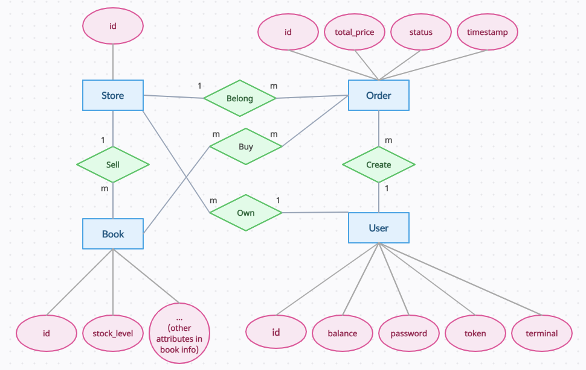

# CS3952 - Database System - Course Project

This project contains two parts. The whole task is to implement a backend of a bookstore, using different databases (MongoDB, PostgreSQL).

- **Project 1 (Group): [Report](SJTU_DMBS_2023_PJ1/bookstore/report/Project_Report.md)**
- **Project 2 (Solo): [Report](SJTU_DMBS_2023_PJ2/bookstore/report/Project_Report.md)**

The ER Graph:

